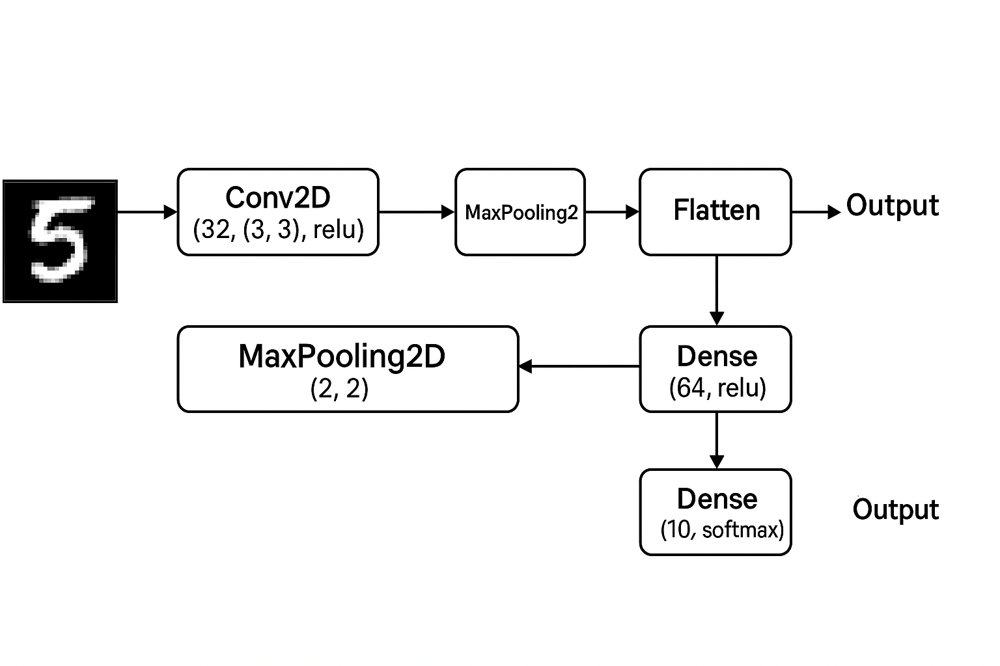
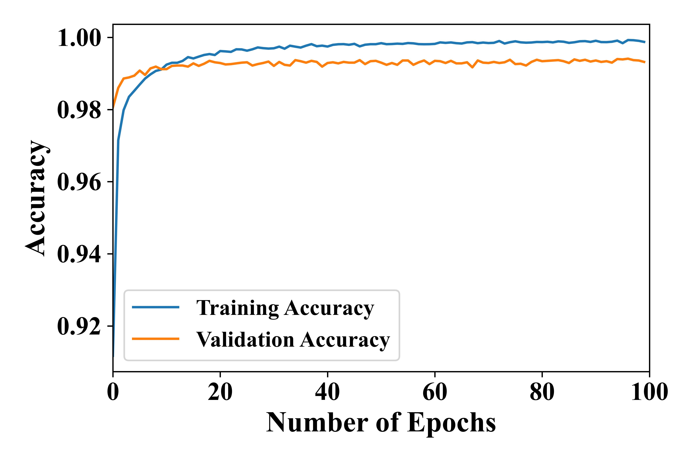
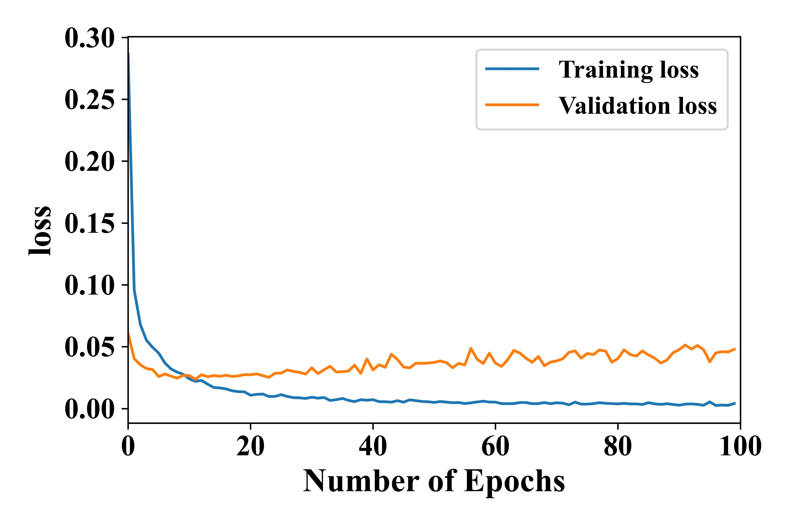
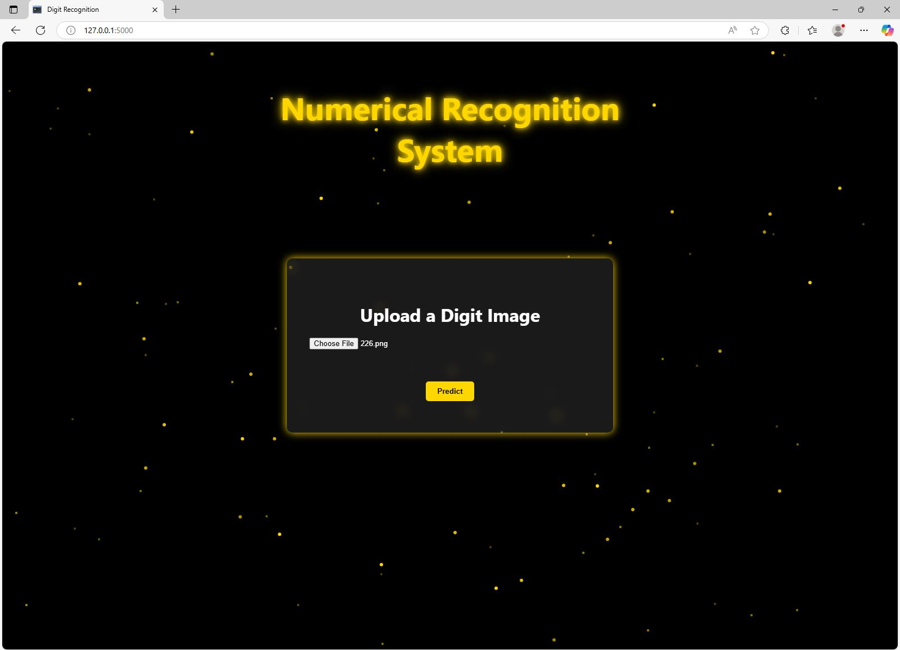
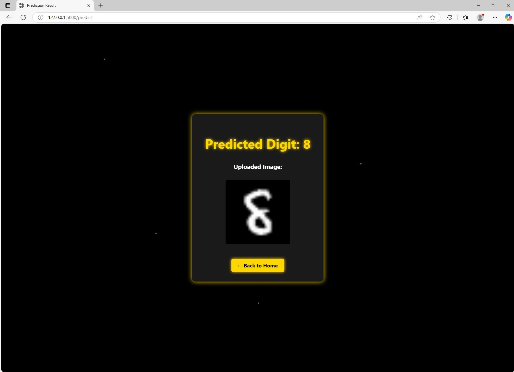

# 🧠 Digit Recognition Web App

**Digit Recognition Web App** is a user-friendly web application built using Flask that allows users to upload images of handwritten digits (0–9) and receive real-time predictions using a Convolutional Neural Network (CNN) model trained on the MNIST dataset. The project leverages Python, TensorFlow/Keras for model training and inference, and HTML/CSS for a responsive interface. Designed for simplicity and educational purposes, this app demonstrates the integration of deep learning models into a web environment for interactive digit classification.

---

## 🚀 Features

- Upload an image of a digit (0-9)
- Predicts the digit using a trained CNN
- Simple UI using HTML/CSS
- Live preview of uploaded digit and prediction

---

## 🛠️ Tech Stack

- Python
- Flask
- TensorFlow / Keras
- MNIST Dataset
- HTML/CSS
---
## CNN Architecture

The architecture illustrates a **Convolutional Neural Network (CNN)** designed for digit recognition, such as on the MNIST dataset. The input is a grayscale image of a digit (e.g., '5'), which passes through a Conv2D layer with 32 filters of size 3x3 and ReLU activation, followed by a MaxPooling2D layer that downsamples the feature maps using a 2x2 window. The output is then flattened into a 1D vector, passed to a Dense (fully connected) layer with 64 units and **ReLU activation**, and finally to another Dense layer with 10 units using softmax activation, producing probabilities for each of the 10 digit classes (0–9). The model predicts the digit with the highest probability as the output.

---
## CNN Result

---
## Screenshot

## 🧪 How to Run Locally

git clone https://github.com/kavitha-35/Digit-Recognition.git
cd Digit-Recognition
python -m venv venv
source venv/bin/activate  # On Windows: venv\Scripts\activate
pip install -r requirements.txt
python app.py

---
## 📁 Project Structure

├── app.py
├── mnist_images/
│   └── Training/
│   └── Testing/
├── templates/
│   ├── index.html
│   └── prediction.html
├── static/
│   └── style.css
|   └── style1.css
├── model/
│   └── Number_Identification_model.keras
├── CNN.py
├── README.md
├── requirements.txt
└── .gitignore

